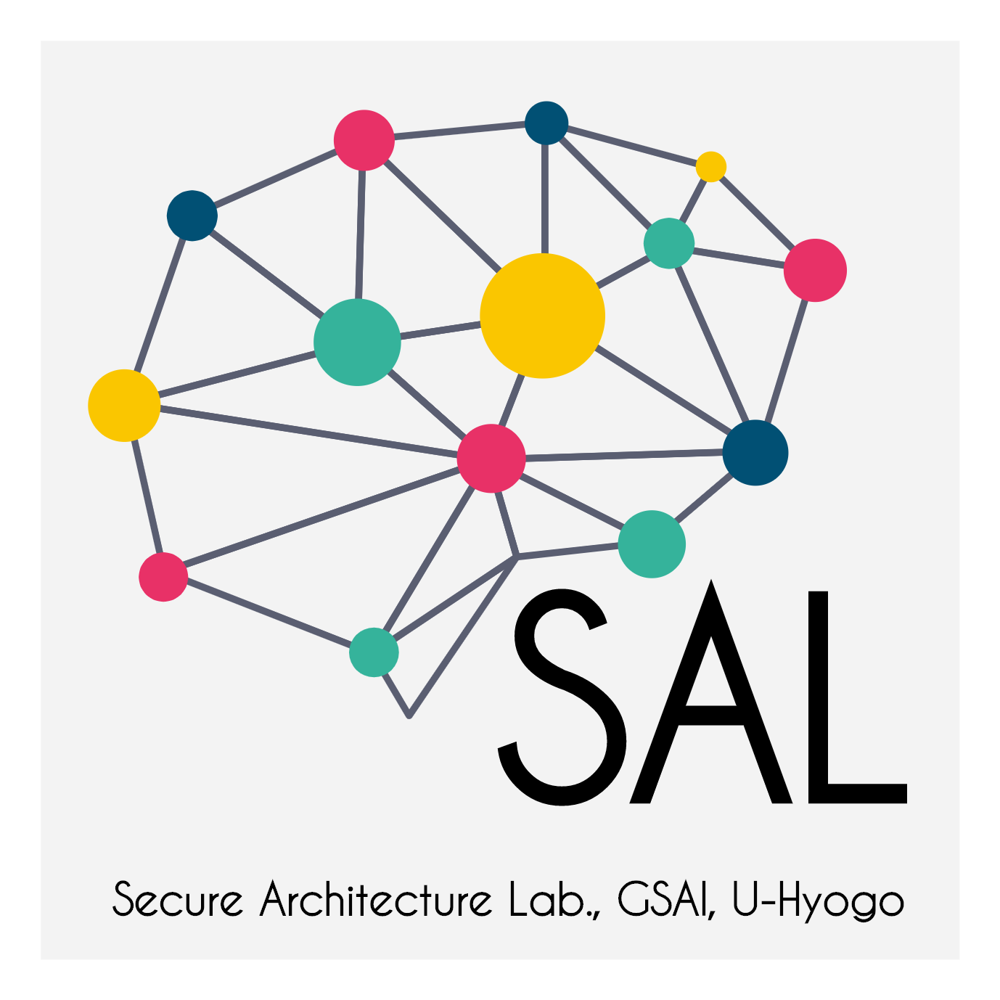

# Welcome

[**[English page is here.]**](./en.md)

<!-- 
 -->
<!--  -->
<!-- 
 -->

**兵庫県立大学大学院 情報科学研究科 セキュアアーキテクチャ研究室**

---

## News

- Sep. 2025: 論文誌 IEICE Transactions on Communications に、Generalized Deduplicationという新しい圧縮アルゴリズムをエッジコンピューティング向けに最適化する手法を提案したフルペーパが採録されました。修了した学生（青島吏輝さん）の研究成果です。

  > R. Aoshima, J. Kurihara and T. Tanaka, ``Aggregable Generalized Deduplication,'' to Appear in IEICE Transactions on Communications, vol. E109-B, no. 3, Mar. 2026.

- Aug. 2025: 論文誌 IEICE Transactions on Fundamentals に、Private Information Deliveryのプライバシ成立条件を証明したフルペーパが採録されました。修了した学生（中野光喜さん）の研究成果です。

  > K. Nakano, J. Kurihara and T. Tanaka, ``Extensive study on the security of private information delivery from coded storage,'' to Appear in IEICE Transactions on Fundamentals of Electronics, Communications and Computer Sciences, vol. E109-A, no. 3, Mar. 2026.

  > 早期公開版: [https://doi.org/10.1587/transfun.2025EAP1094](https://doi.org/10.1587/transfun.2025EAP1094)

- Jul. 2025: [IBMミドルウェアユーザ会 2025年度総会](https://jimuc.connpass.com/event/360581/)にて、栗原が特別講演を行います。(2025年7月11日)

  > 栗原淳, ``プライバシ保護のためのインターネットアーキテクチャの進化,'' IBMミドルウェアユーザ会 2025年度総会, Jul. 2025. [発表資料](https://www.slideshare.net/slideshow/2025-07-11/281465507)

- Jan. 2025: 栗原が[電子情報通信学会シニア会員](https://www.ieice.org/jpn/senior/senior_member24.html)になりました。

- Dec. 2024: 情報理論とその応用シンポジウム (Symposium on Information Theory and Its Applications; SITA) 2024のポスターセッションにて発表しました。

  > 中野光喜, 栗原淳, 田中俊昭, ``任意の線形符号を用いたPrivate Information Deliveryとその特徴づけ,'' SITA 2024, Dec. 2024.

- Nov. 2024: IEICE Transactions on Information and Systemsに招待論文が採録されました (2025年6月出版)。

  > T. Hasegawa, Y. Koizumi, J. Takemasa, J.Kurihara, T. Tanaka, T. Wood and K. K. Ramakrishnan, ''Leveraging Heterogeneous Programmable Data Planes for Security and Privacy of Cellular Networks, 5G & Beyond,'' IEICE Transactions on Information and Systems, vol. 108-D, no. 6, pp. 485--493, Jun. 2025. ([DOI](https://doi.org/10.1587/transinf.2024NTI0001))

- Nov. 2024: 国際会議 International Symposium on Information Theory and Its Applications (ISITA2024 @台北, 台湾) に2件フルペーパが採録されました。

  > Koki Nakano, Jun Kurihara, Toshiaki Tanaka, ''Private Information Delivery from Coded Storage against Byzantine and Eavesdropping Attacks,'' in Proc. ISITA 2024, Nov. 2024.

  > Riki Aoshima, Jun Kurihara, Toshiaki Tanaka, ``Aggregable Generalized Deduplication,'' in Proc. ISITA 2024, Nov. 2024.

- Oct. 2024: 情報処理学会コンピュータセキュリティシンポジウム2024 (CSS2024@神戸) で、2件発表します。

  > 橋本 俊甫, 田中 俊昭, 栗原 淳, ''クライアントの行動に基づくビザンチン耐性のある連合学習の監視メカニズム,'' in Proc. CSS2024, Oct. 2024

  > Hiroki Kimura, Jun Kurihara, Toshiaki Tanaka, ''Security Analysis of the Smart Lock Products against the Device Hijacking Attacks,'' in Proc. CSS2024, Oct. 2024

- May. 2024: 任意の線形秘密分散法とセキュアネットワーク符号化において、新たな安全性尺度を提案し、その精密な値が符号パラメータで記述できることを明らかにした論文が、国際論文誌 IEEE Accessに採録されました。修了した学生（栗原頂さん）の研究成果です。

  > I. Kurihara, J. Kurihara and T. Tanaka, ''A New Security Measure in Secret Sharing Schemes and Secure Network Coding,'' IEEE Access, vol. 12, pp. 69163--69171, May 2024. ([DOI](https://doi.org/10.1109/ACCESS.2024.3401471))

---

## この研究室について

### 研究内容

私たちは、情報通信・ネットワークを中心として、堅牢性や効率性、また安全性・プライバシ性の高いアーキテクチャ・システム・プロトコルを作り上げるための研究を行っています。特に、基礎的分野では符号理論を元にしたプロトコルの構築、応用的分野では新しいネットワークアーキテクチャやその匿名化・認証プロトコルの研究などを行っています。

- 情報理論や符号理論の技術を用いた、通信プロトコルや、セキュリティ・プライバシ保護手法の研究。例えば、秘密分散法、private information retrievalなど。理論限界を求め、それを達成するにはどうしたらいいか、などを考えています。
- 情報指向ネットワーク (Information-centric Networking; ICN) における、効率的なプロトコルや新しいセキュリティメカニズムの研究。
- ネットワーク内コンピューティング・エッジコンピューティングなど、新しい計算アーキテクチャにおける数理的フレームワークの研究や、信頼できない計算基盤でのユーザプライバシ保護方法の研究。機械学習特有の計算など、多種多様な計算アルゴリズムの実行や、計算のためのデータのやり取りをセキュアに行う基盤の構築方法を考えています。

詳細な研究内容や出版履歴については、[Researchmap](https://researchmap.jp/junkurihara)、[栗原のWebサイト](https://junkurihara.github.io)、[GitHub](https://github.com/junkurihara) などを参照して下さい。ある一部のトピックのみを切り出したものですが、[研究室紹介資料 (PDF)](../repo/lab-info-20200326.pdf) や [DNS匿名化の資料 (Slideshare)](https://www.slideshare.net/slideshow/mutualized-oblivious-dns-odns-hiding-a-tree-in-the-wild-forest-249693576/249693576) などのスライドもご参照下さい。

### 栗原 淳 (Jun KURIHARA) [[WebSite](https://junkurihara.github.io)]

研究開発からソフトウェア・Webサービスの製品化、通信サービス開発の企画、標準化から教育、オープンソースプロジェクトなどの経験をしてきています。

---

## 良い研究をするために：東京科学大学 植松友彦先生 「研究読本」

植松先生の書かれた「研究読本」は研究室を選ぶために、そして研究を始めるために必要な事柄が全て記載されています。分野に関わらず必ず一度目を通すと良いと思います。 [[link (PDF)](http://www.it.ce.titech.ac.jp/uyematsu/howtoresearch.pdf)] [[mirror](../repo/howtoresearch.pdf)] (Copyright Prof. Uyematsu)

上記植松先生の資料のツール部分・情報ソース部分について、栗原が2022年バージョンの副読資料を作成しました。原著に全て重要な情報は載っていますが、その情報を自分自身で運用するのに、この副読資料が役立てば幸いです。[[link (PDF)](../repo/htr2022.pdf)]

---

## Links

<!-- - [**この研究室について**](./ja/about.md) -->
<!-- - [**この研究室へ所属を希望する学生の方々へ**](./ja/to-students.md) -->
<!-- - [研究指南書リスト](./ja/research-guides.md) -->
<!-- - [研究室でのエンジニアリング (研究やソフトウェア開発) の環境準備](./ja/engineering-env.md) -->
<!-- - 栗原の活動の参考: -->
- [栗原のWebサイト (junkurihara.github.io)](https://junkurihara.github.io/)
- [栗原のSlideshare (講演資料・講義スライド)](https://www.slideshare.net/JunKurihara2)
- [栗原のGitHub (講義スライド・サンプルコード、ソースコード)](https://github.com/junkurihara)
  - [セキュリティエンジニアリング特論の資料](https://github.com/junkurihara/lecture-security_engineering)
  - [HTTP/3対応の超高速HTTPリバースプロキシ: `rpxy`](https://github.com/junkurihara/rust-rpxy)
  - [JavaScript暗号ユーティリティ: `jscu`](https://github.com/junkurihara/jscu)
  - [匿名化DNSプロジェクト: Mutualized Oblivious DNS](https://junkurihara.github.io/dns/)
  - [Generalized Deduplication (GD) のRust実装: `rust-gd`](https://github.com/junkurihara/rust-gd)

---

## 受託・共同研究

現在は以下の企業と実施しています。

- 株式会社LabBase

## 競争的資金

- NSF-NICT JUNO 3: 2022-2025 CoPI
- 日本学術振興会 科学研究費
  - 基盤B 2025--2028 PI
  - 基盤C 2022--2025 PI

---

## 連絡先

- Please check my latest email address on my papers/presentations/repositories, or contact via LinkedIn.
- スパム避けのためメールアドレスはここに記載していません。栗原のWebサイトにある最近の論文PDFなどにアドレスが載っているため、そちらをご参照ください。

## 研究室へのアクセス

所在地: 650-0047 兵庫県神戸市中央区港島南町7丁目1番28 計算科学センタービル 6F

- [神戸情報科学キャンパスへのアクセス](https://www.u-hyogo.ac.jp/campuslife/access/campus06.html)
- [Google Map](https://goo.gl/maps/K5GnaLVAoKssnBkp7)
