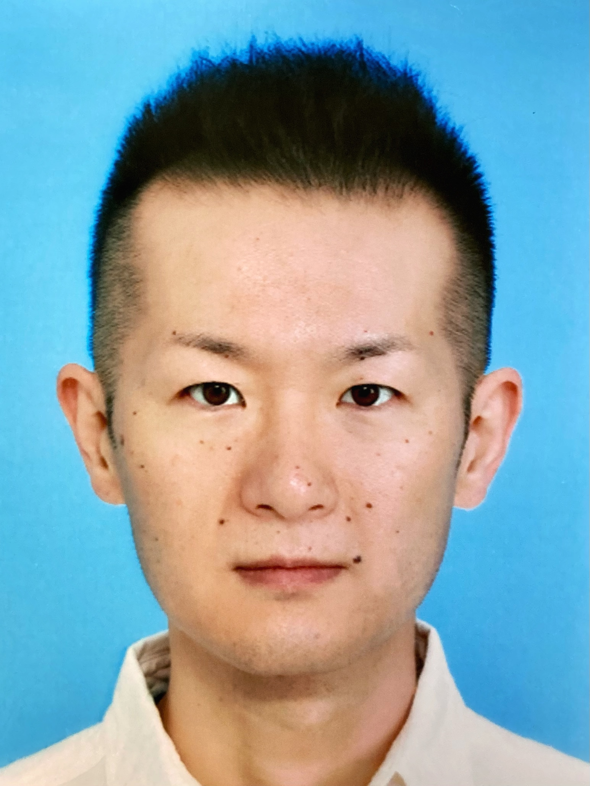

# セキュアアーキテクチャ研究室について

私たちは、情報通信・ネットワークを中心として、堅牢性や効率性、また安全性・プライバシ性の高いアーキテクチャ・システム・プロトコルを作り上げるための研究を行っています。特に、基礎的分野では符号理論を元にしたプロトコルの構築、応用的分野では新しいネットワークアーキテクチャやその匿名化・認証プロトコルの研究などを行っています。

## 研究内容

- 情報理論や符号理論の技術を用いた、通信プロトコルや、セキュリティ・プライバシ保護手法の研究。例えば、秘密分散法、private information retrievalなど。理論限界を求め、それを達成するにはどうしたらいいか、などを考えています。

  - 強い安全性を有するユニバーサルネットワーク符号化の構成手法と安全性評価の研究 (IEEE Trans. Inf. Theory 2015)
  - 線形符号のパラメータと秘密分散法の安全性との関連性を解明する研究 (IEICE Trans. 2013)
  - 超高速な秘密分散法のアルゴリズム構成と、その安全性証明手法の研究 (IEICE Trans. 2009)
  - etc

- 情報指向ネットワーク (Information-centric Networking; ICN) における、効率的なプロトコルや新しいセキュリティメカニズムの研究。

  - コンテンツの暗号化ベースのアクセス制御を応用した、情報指向ネットワークでの検閲回避方式の構成と評価の研究 (ACM ICN 2016)
  - 情報指向ネットワークのリクエストパケットのリスト化によるルータ転送高速化手法の構成、理論的、実装的評価の研究 (IEICE Trans. 2016)
  - etc.

- ネットワーク内コンピューティング・エッジコンピューティングなど、新しい計算アーキテクチャにおける数理的フレームワークの研究や、信頼できない計算基盤でのユーザプライバシ保護方法の研究

  - 情報検索におけるプライバシ保護プロトコル「Private Information Retrieval」でデータサーバに攻撃者が含まれていた場合に正しく情報が取得できる限界値を解明する研究。(IEICE ComEx 2020 / IEICE Trans. 2021)
  - DNSプロトコル匿名化の研究 (2021〜)
  - etc.

詳細な研究内容や出版履歴については、[Researchmap](https://researchmap.jp/junkurihara)、[栗原のWebサイト](https://junkurihara.github.io)、[GitHub](https://github.com/junkurihara) などを参照して下さい。簡単な[研究室紹介資料 (PDF)](../repo/lab-info-20200326.pdf)もご参照下さい。

---

## メンバー

### 准教授: 栗原 淳 (くりはら じゅん)

#### [自己紹介]

東京工業大学の修士課程を修了した後、通信事業者の研究開発や技術系企画の業務に従事しました。その後、研究開発系スタートアップの主任研究員と、兵庫県立大の准教授のポジションを得ています。研究開発からソフトウェアの製品化、通信サービス開発のプロマネ、標準化から教育まで無差別にやってきました。現役のソフトウェアエンジニアです。

研究領域も、セキュリティに限らず、また基礎理論や応用にとどまらず、「何でも屋」に近いです。基礎分野では、情報理論・符号理論を利用した安全な通信プロトコルの開発、その理論限界値の研究がメインです。応用分野では、社会に適したネットワークアーキテクチャやその機構を考えることが多いです。漠としていますが、新しいシステムを考えて、モデル化して実用に耐えるかどうか検証したり、コーディングしてPoC (Proof-of-Concept) をするというのを、色んなところでやっています。

#### [最近の興味]

最近興味があるのは、個人のプライバシや著作権を法制度以外でどうやって守るのか、今の法制度では守ることのできないプライバシや著作権を新たな技術で守れないのか、ということです。

例えば、憲法において「通信の秘密」が守られているのですが、これがあるが故に、日本国では、違法漫画サイトへのアクセスブロッキング (DNSブロッキング) を行うことができず、結果として著作者の権利を守ることもできませんでした。これは今のインターネットの構造 (アーキテクチャ) が過去の郵便と同じような構造になっていることにも起因します。このようなインターネットの構造にまつわる課題は、新たなネットワークで情報が流通される世界になれば「個人のプライバシを侵すことなく」、解決できるのではないかと考えています。そのために、情報指向ネットワークによる情報流通や、情報取得プロトコル (検索やDNSクエリなど) の匿名化の研究を進めています。

上記のような「アーキテクチャの研究」は多分に「思想」に紐づいています。「こういう社会になったら嬉しいな」を技術的に考えること、その有効性を問い、なんらかの形で実証すること、を頑張っています。

他にも、分散計算や、秘匿計算について、それらのアルゴリズムだけではなく「どのノードでどういう計算をさせると安全なのか」というようなシステムアーキテクチャについても興味があります。

私の研究活動に興味のあるものがあれば、ぜひコンタクトしてきてください。

### リンク

- [Webサイト](https://junkurihara.github.io)
- [Github](https://github.com/junkurihara)
- [Slideshare](https://www.slideshare.net/JunKurihara2)
- [LinkedIn](https://www.linkedin.com/in/junkurihara/)
- [Google Scholar](https://scholar.google.co.jp/citations?user=e0XuwAoAAAAJ&hl=ja)
- [Researchmap](https://researchmap.jp/junkurihara)

---

## メンバー

### M1: 木村 紘樹 (きむら　ひろき)

#### [自己紹介]

- ～2016年　　　　上智大学 大学院 電気電子工学科を修了。国内の大手モバイル通信事業者にて勤務
- 2016年～2018年　モバイルショップのオペレータ向けナレッジ支援システム開発に従事
- 2019年～2021年　アカウント認証のシステム開発に従事、FIDO認証やOpenIDConnectを提供
- 2022年　　　　　セキュリティ分野の技術習得のため兵庫県立大学 大学院 情報科学研究科へ入学（8月よりカーネギーメロン大学へ留学予定）

---

 **[[Back to top page]](../index.md)**
